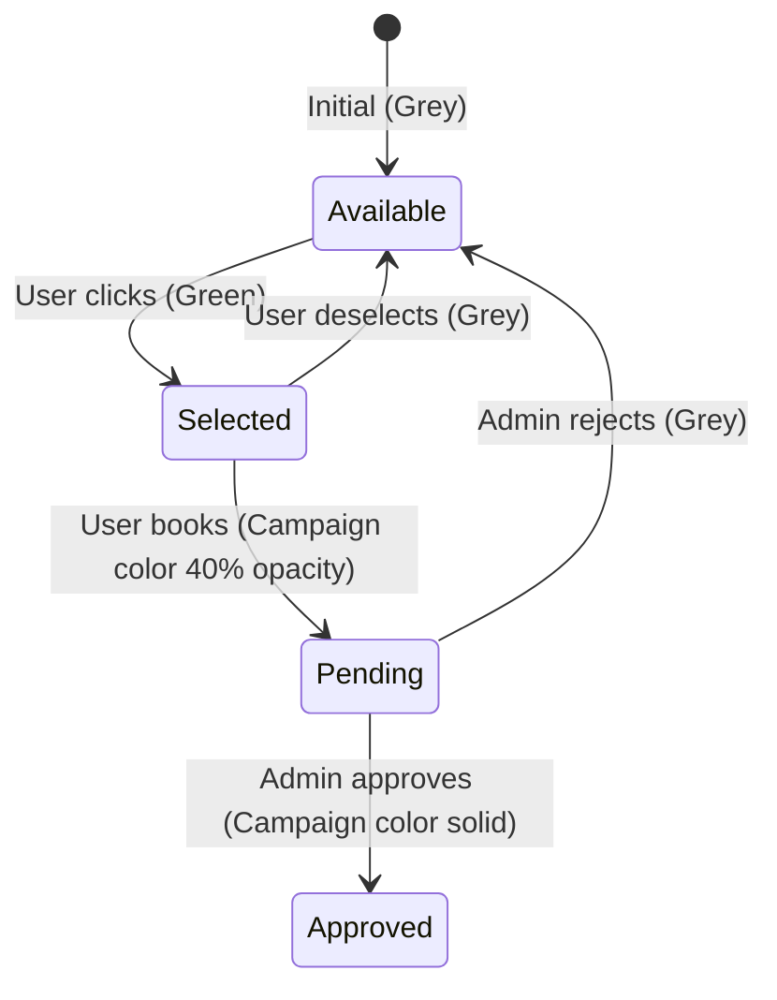

# Seat Booking Application

A 3-page seat booking app (login, seat booking, admin) with campaign-based coloring, booking workflow with approval states, and a floor map matching the provided screenshot.

## User Review Required

> [!IMPORTANT]
> **Data Storage**: Since Supabase is installed but no DB schema/keys are configured yet, I'll use **localStorage** for this MVP so you can see everything working immediately. We can migrate to Supabase later. Is that OK?

> [!IMPORTANT]
> **Campaign List**: From your screenshot I identified these campaigns: **TEMU** (blue), **CRM** (orange), **CBN CRM** (pink/magenta), **CBN L1/Red** (red), **Indofood** (purple), **CBN Blue** (dark blue), **CBN L2** (dark purple). Please confirm these are correct and if any are missing.

> [!IMPORTANT]
> **Floor Map**: The map will be an **SVG/CSS grid** representation matching your screenshot layout — seats arranged in clusters with lifts, stairs, toilets, and server room as non-interactive elements. The exact seat count and positions will approximate your screenshot (~247 seats). Let me know if you need pixel-perfect accuracy or if a close approximation is fine.

## Proposed Changes

### Data Model & Types

#### [NEW] [types.ts](file:///c:/Users/alvin/Documents/seat-booking-system/src/app/types.ts)
Define TypeScript interfaces:
- `Campaign` — `id`, `name`, `color` (hex)
- `Seat` — `id`, `label`, `x`, `y`, `width`, `height`, `status` (available/selected/pending/approved), `campaignId`
- `Booking` — `id`, `seatId`, `campaignId`, `userId`, `status` (pending/approved/rejected), `timestamp`
- `User` — `id`, `username`, `role` (admin/user)
- Campaign color map with the 7 campaigns

---

### Authentication & Context

#### [NEW] [context/AuthContext.tsx](file:///c:/Users/alvin/Documents/seat-booking-system/src/app/context/AuthContext.tsx)
- React Context for authentication state
- Stores current user, selected campaign
- Hardcoded accounts: `admin`/`admin123` (admin role), `user`/`user123` (user role)
- Persist login state in localStorage

---

### Login Page

#### [MODIFY] [page.tsx](file:///c:/Users/alvin/Documents/seat-booking-system/src/app/page.tsx)
- Replace default Next.js boilerplate with login form
- Username + password fields with premium dark-themed design
- Route to `/booking` (user) or `/admin` (admin) after login
- Gradient background, card-based form with blur effect

---

### Seat Booking Page

#### [NEW] [booking/page.tsx](file:///c:/Users/alvin/Documents/seat-booking-system/src/app/booking/page.tsx)
- Campaign selector dropdown at top
- Floor map component showing all seats
- Click seat to select (grey → green), click "Book" to confirm (green → transparent campaign color = pending)
- Legend showing seat states
- Header with user info and logout

#### [NEW] [components/FloorMap.tsx](file:///c:/Users/alvin/Documents/seat-booking-system/src/app/components/FloorMap.tsx)
- Main floor map component rendering the office layout
- Seats as interactive rectangles with labels
- Non-interactive elements: lifts (3), stairs, toilets, server room, lift barang
- Seat layout matching the screenshot:
  - **Top-left cluster**: ~60 seats (mostly TEMU blue)
  - **Top-center cluster**: ~20 seats (CRM orange)
  - **Top-right cluster**: ~20 seats (CBN L1/Red)
  - **Middle area**: facilities (lifts, stairs, toilets, server)
  - **Middle-right**: ~15 seats (mixed)
  - **Bottom-left**: small cluster (~8 seats)
  - **Bottom area**: ~80 seats in large blocks (Indofood purple, CBN Blue, CBN L2)
  - **Bottom row**: ~15 seats (L1-L15 labels)

#### [NEW] [components/SeatComponent.tsx](file:///c:/Users/alvin/Documents/seat-booking-system/src/app/components/SeatComponent.tsx)
- Individual seat rendering with color states:
  - **Available**: grey (`#9ca3af`)
  - **Selected** (clicked, not yet booked): green (`#22c55e`)
  - **Pending** (booked, awaiting approval): campaign color at 40% opacity
  - **Approved**: campaign color solid
- Shows seat label text
- Click handler for booking interaction

---

### Admin Page

#### [NEW] [admin/page.tsx](file:///c:/Users/alvin/Documents/seat-booking-system/src/app/admin/page.tsx)
- Protected route (admin only)
- Shows floor map (read-only view) with current seat states
- Panel showing pending bookings list
- Approve/Reject buttons for each pending booking
- Approve → seat turns solid campaign color
- Reject → seat turns back to grey

---

### State Management

#### [NEW] [lib/store.ts](file:///c:/Users/alvin/Documents/seat-booking-system/src/app/lib/store.ts)
- localStorage-based state management
- Functions: `getSeats()`, `updateSeat()`, `getBookings()`, `addBooking()`, `approveBooking()`, `rejectBooking()`
- Initialize with default seat layout matching floor map
- Campaign color definitions

---

### Layout & Styling

#### [MODIFY] [layout.tsx](file:///c:/Users/alvin/Documents/seat-booking-system/src/app/layout.tsx)
- Wrap app in `AuthProvider`
- Update metadata title to "Seat Booking System"

#### [MODIFY] [globals.css](file:///c:/Users/alvin/Documents/seat-booking-system/src/app/globals.css)
- Dark theme as default
- Custom styles for floor map, seat animations, and transitions

---

## Seat Color State Machine

## Verification Plan

### Browser Testing
1. **Start dev server**: `npm run dev` from project root
2. **Login page**: Open `http://localhost:3000`
   - Verify login form appears with username/password
   - Login as `user`/`user123` → redirected to `/booking`
   - Login as `admin`/`admin123` → redirected to `/admin`
   - Invalid credentials show error
3. **Booking page** (`/booking`):
   - Campaign selector visible with all 7 campaigns
   - Floor map renders with correct layout matching screenshot
   - Select a campaign → click grey seat → turns green
   - Click "Book Selected" → seat turns campaign color at 40% opacity
   - Seat label text is readable
4. **Admin page** (`/admin`):
   - Pending bookings list shown
   - Click "Approve" → seat turns solid campaign color on map
   - Click "Reject" → seat turns back to grey
5. **Visual check**: Floor map layout matches the provided screenshot (seat clusters, facilities, labels)

### Manual Verification (User)
- Please visually compare the resulting floor map with your original screenshot and confirm the layout is acceptable
- Please test the booking flow end-to-end and confirm the color transitions match your expectations
